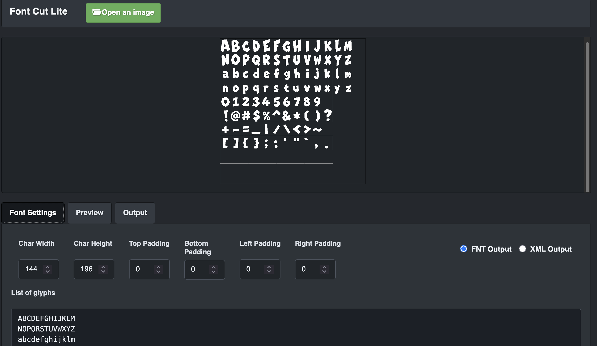

Font Cut Lite
=============

Forked from https://github.com/fabienbk/fontcutter.

Font Cut Lite is a local HTML5 tool for generating AngelCode bitmap font descriptors from an existing fixed-grid bitmap font image. It can export both plain `.fnt` text and XML descriptors for use in game engines and UI pipelines.



## Main Features

- Load a bitmap font sheet from a file picker or a URL query parameter.
- Configure fixed cell size with `Char Width` and `Char Height`.
- Enter glyph rows manually, including intentional spaces with preserved leading/trailing whitespace.
- Preview each glyph cell with visible labels for spaces.
- Adjust per-character `xadvance` from the Preview tab with an inline slider.
- Automatically calculate centered `xoffset` from `xadvance`.
- Persist editor state in `localStorage` so refreshes keep glyph rows, dimensions, padding, output type, and metrics.
- Run fully locally with vendored browser dependencies.

## Running Locally

Open `index.html` directly, or serve the folder for query-parameter image loading:

```sh
python3 -m http.server 8000
```

Then open:

```text
http://localhost:8000/
```

To auto-load a served image:

```text
http://localhost:8000/?image=tests/assets/comic_font_img.png
```

Use `?reset=1&image=...` when you want to clear saved editor state before loading a test image.

## Test Asset

The repository includes a sample bitmap font at:

```text
tests/assets/comic_font_img.png
```

Suggested settings for this image:

```text
Char Width: 144
Char Height: 196
```

Paste this glyph text into `List of glyphs`:

```text
ABCDEFGHIJKLM
NOPQRSTUVWXYZ
abcdefghijklm
nopqrstuvwxyz
0123456789 
!@#$%^&*()?
+-=_|/\<>~
[]{};:'"`,.
```
